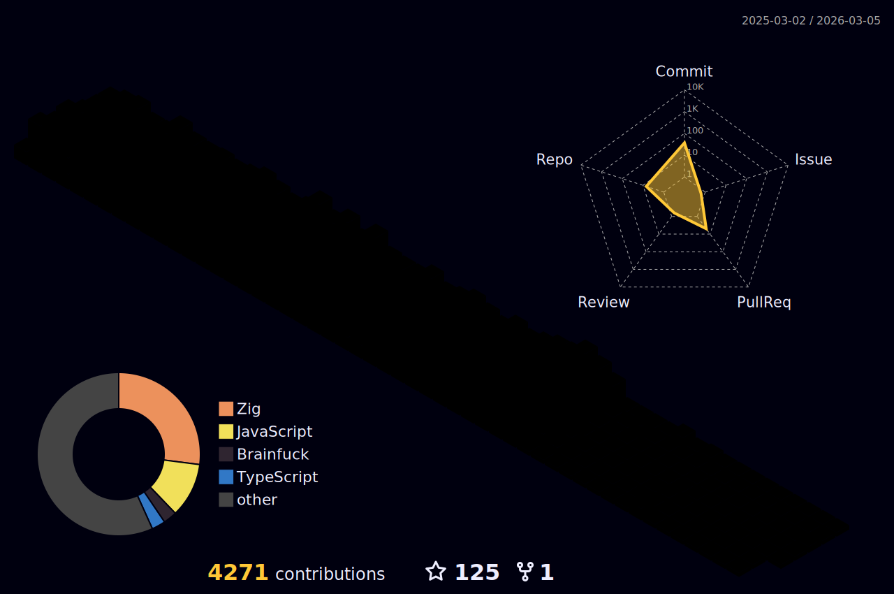

<h2 align="center" style="color:#66fcf1;font-family:Arial,Helvetica,sans-serif;">
  🚀 Featured Projects
</h2>

<section style="
  display:flex;
  flex-wrap:wrap;
  justify-content:center;
  align-items:center;
  gap:20px;
  background:linear-gradient(145deg,#0f2027,#203a43,#2c5364);
  border-radius:16px;
  padding:20px;
  box-shadow:0 0 30px rgba(0,0,0,0.3);
">

  

  

  

  
</section>

<h3 align="center">A passionate [FullStack | A.I | Blockchain | Mobile | Robotics] Developer</h3>

  

- 🔭 I’m currently working on [Kurdi Academy](https://kurdiacademy.com)

- 🌱 I’m currently learning **Deep Learning, Web3js Intergrated with AI**

- ✅ Founder of ASMC (Admin System Management Center): <a href="https://asmc.yousifwali.tech">https://asmc.yousifwali.tech</a>

- 💬 Ask me about **ReactJs, Javascript, Golang, Python**

- 📫 How to reach me **me@yousifwali.tech**
- 🔥 Top 4 @USA leaderboard on Sololearn platform

- ☄️ Top 35 @GLOBAL leaderboard on Sololearn platform
  
<h3 align="left">Connect with me:</h3>

<h3 align="left">Languages and Tools:</h3>

     

&nbsp;

